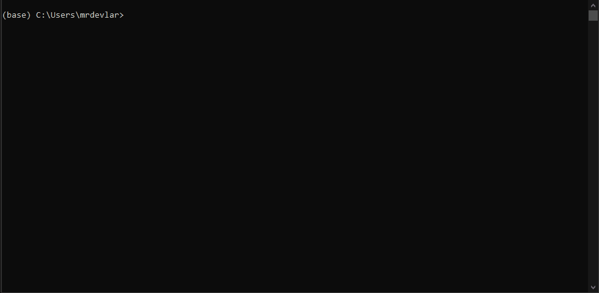
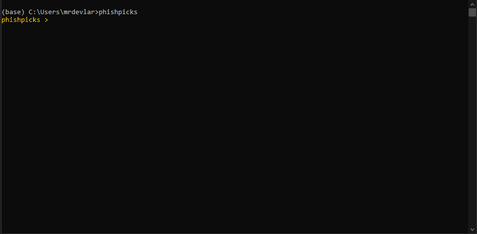

# PhishPicks

A command-line CRUD for selecting, playing and randomizing Phish shows/tracks on disk or with a digital music player.

## Shows



## Tracks


## Digital Audio Player



[The Spreasheet](https://docs.google.com/spreadsheets/u/0/d/1yAXu83gJBz08cW5OXoqNuN1IbvDXD2vCrDKj4zn1qmU/htmlview?pli=1#)

While it was designed to be used with Phish shows, in principle, nothing prevents this from being used to play any type of other live shows. The criteria for operation is:
- Folders must contain unique dates for shows
- Dates are in YYYY-MM-DD format in the folder names
- Audio must be in mp3, flac or m4a files
- All audio files must have ID3 tags

## User Story

So like many programming hobby projects, they start with a problem you want to solve that kind of spirals out of control into a usable application.

In this case, the problem was, _"I want to be able to randomly play a Phish show"_. That was, in itself, a pretty easy thing to solve with a folder full of Phish shows. 

After a while new requirements came into play:

- I want to be able to pick a random show, but I don't want repeats (`random %n` in all menus and `exhaustion mode`)
- I want to be able to transfer a show to my digital media player (`dap` menu)
- I want to be able to store a list of all the "good jams" (`to_special` in tracks)
- I want to be able to keep a queue of next shows to listen to when they get recommended (`load_queue` in `shows` menu)
- I want a programmatic interface to this system, so I can do arbitrary things with the data (`data` menu, this package also runs in the Python REPL)
- I want a command line interface for fast access (`phishpicks` from cmd line)
- I want autocomplete on show dates and track names (Both `shows` and `tracks` does this)
- I want autocomplete on data operations so users don't have to look anything up (`data` menu)
- I want to ...

It felt like one of the most organic development processes I've had the good fortune to create. Over time, it did all of these things and became a "mature" system I turn to whenever I listen to Phish.

I hope that it might turn out to be useful to more than myself. 

## Usage

- Clone Repo
- `cd..`
- `pip install -e phishpicks`
- This will install the command line `phishpicks` command
- `phishpicks` to start

OR
- `pip install git+https://github.com/mrdevlar/phishpicks.git`
- This will install the command line `phishpicks` command
- `phishpicks` to start

## Commands
- `help` - to list all commands, like below, within a menu it'll also give you menu specific help
```
_____ COMMANDS _____
     help: This List
    shows: Select Shows
   tracks: Select Tracks
   random: Random Picks
configure: Launch Configuration Wizard
     data: Launch Database Operations
     play: Play Selection with Media Player
    clear: Clear Picks
     exit: Leave

 _____ KEYBOARD _____
Backspace: return to main menu / exit
      Tab: cycle through autocomplete
    Space: continues text
    Enter: submits command
```

## Notes
`data` - data methods used to manipulate the database.

There are plenty of things you can do with the database outside of normal operations (picking and playing). Any method in the `data.py` file can be called from this menu.

Can be used to `update` when new folders are added, as well as `drop_all` and `populate` to reset everything. Generally, update is done on launch of `phishpicks` also. 

## TODOS
- More fine-grained manipulation of Picks selection, like filtering and removing rather than clearing and restarting. Requires a sensible syntax.
- Completer classes for function parameterization. So `random` displays `n` and perhaps the docstring in the data menu.
- Frontend code requires a refactor. 